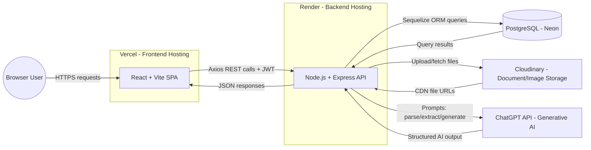

```mermaid
graph LR
    User(("Browser User"))

    subgraph Vercel["Vercel - Frontend Hosting"]
        Frontend["React + Vite SPA"]
    end

    subgraph Render["Render - Backend Hosting"]
        Backend["Node.js + Express API"]
    end

    Neon[("PostgreSQL - Neon")]
    Cloudinary["Cloudinary - Document/Image Storage"]
    ChatGPT["ChatGPT API - Generative AI"]

    User -->|HTTPS requests| Frontend
    Frontend -->|Axios REST calls + JWT| Backend
    Backend -->|JSON responses| Frontend
    Backend -->|Sequelize ORM queries| Neon
    Neon -->|Query results| Backend
    Backend -->|Upload/fetch files| Cloudinary
    Cloudinary -->|CDN file URLs| Backend
    Backend -->|Prompts: parse/extract/generate| ChatGPT
    ChatGPT -->|Structured AI output| Backend
```
