```mermaid
erDiagram
    %% ===== Shared / Auth (Group) =====
    USERS ||--o{ TENDERS : "creates"
    USERS ||--o{ TENDER_DOCUMENTS : "uploads"
    USERS |o--o{ ELIGIBILITY_CHECKS : "checks"
    USERS |o--o{ ELIGIBILITY_THRESHOLDS : "configures"
    USERS ||--o{ EVALUATION_CRITERIA : "defines"
    USERS ||--o{ EVALUATIONS : "evaluates"
    USERS |o--o{ RISK_ASSESSMENTS : "reviews"
    USERS ||--o{ APPROVALS : "decides"
    USERS ||--o{ BOARD_PAPERS : "prepares"
    USERS |o--o{ CLARIFICATION_LOGS : "escalates"
    USERS |o--o{ CLARIFICATION_LOGS : "resolves"
    USERS |o--o{ CLARIFICATION_MESSAGES : "approves"
    USERS ||--o{ CLARIFICATION_MESSAGES : "authors"
    USERS ||--o{ JOB_ADJUSTMENT_REQUESTS : "requests"
    USERS |o--o{ JOB_ADJUSTMENT_REQUESTS : "approves"
    USERS ||--o{ SCORING_ARCHIVES : "archives"

    %% ===== Scope A: Zheng Hong (Tender Intake, Documents, Eligibility) =====
    TENDERS ||--o{ TENDER_DOCUMENTS : "has"
    TENDERS ||--o{ ELIGIBILITY_CHECKS : "checked for"

    %% ===== Scope B: Jerrold (Evaluation, PQM, Risk, Approval) =====
    TENDERS ||--o{ EVALUATIONS : "scored by"
    EVALUATIONS ||--o{ RISK_ASSESSMENTS : "generates"
    EVALUATIONS ||--o{ APPROVALS : "receives"

    %% ===== Scope C: Calista (Board Paper / Proposal Generation) =====
    %% NOTE: sourced from TENDERS directly (tender_id), not EVALUATIONS - see Sync Notes below.
    TENDERS ||--o{ BOARD_PAPERS : "generated from"
    BOARD_PAPERS ||--o{ PROPOSALS : "summarized as"
    BOARD_PAPERS ||--o{ UPLOADED_DOCUMENTS : "supported by"

    %% ===== Scope D: Sulaiman (Clarification / Job Adjustment) =====
    TENDERS ||--o{ CLARIFICATION_LOGS : "raises"
    CLARIFICATION_LOGS ||--o{ CLARIFICATION_MESSAGES : "has"
    CLARIFICATION_MESSAGES ||--o{ CLARIFICATION_ATTACHMENTS : "has"
    CLARIFICATION_MESSAGES |o--o{ CLARIFICATION_MESSAGES : "dispatched from"
    CLARIFICATION_LOGS ||--o{ JOB_ADJUSTMENT_REQUESTS : "prompts"
    TENDERS ||--o{ JOB_ADJUSTMENT_REQUESTS : "affected by"
    CLARIFICATION_MESSAGES |o--o{ JOB_ADJUSTMENT_REQUESTS : "sourced from"
    JOB_ADJUSTMENT_REQUESTS |o--o| CLARIFICATION_LOGS : "confirmed via follow-up"

    %% ===== Scope E: Kai Xuan (Strategic Rankings Dashboard) =====
    %% NOTE: no formal FK from SCORING_ARCHIVES to TENDERS - see Sync Notes below.

    USERS {
        INTEGER id PK
        STRING full_name
        STRING email
        STRING password_hash
        ENUM role
        STRING avatar_url
        DATE created_at
        DATE updated_at
    }

    TENDERS {
        INTEGER id PK
        STRING tender_ref_no
        STRING vendor_name
        DATE submission_date
        DECIMAL main_offer_price
        DECIMAL alternative_offer_price
        DECIMAL paid_up_capital
        STRING bca_fm01_license_no
        ENUM bca_fm01_grade
        BOOLEAN non_debarment_declared
        ENUM eligibility_status
        TEXT ai_eligibility_summary
        ENUM status
        INTEGER created_by FK
        DATE created_at
        DATE updated_at
    }

    TENDER_DOCUMENTS {
        INTEGER id PK
        INTEGER tender_id FK
        ENUM file_type
        STRING original_filename
        STRING cloudinary_public_id
        STRING file_url
        ENUM resource_type
        STRING format
        INTEGER file_size_bytes
        INTEGER version
        BOOLEAN is_latest
        INTEGER uploaded_by FK
        DATE uploaded_at
    }

    ELIGIBILITY_CHECKS {
        INTEGER id PK
        INTEGER tender_id FK
        ENUM criterion
        DECIMAL threshold_value_used
        DECIMAL actual_value
        BOOLEAN passed
        ENUM source
        TEXT notes
        INTEGER checked_by FK
        DATE checked_at
    }

    BCA_GRADE_LIMITS {
        INTEGER id PK
        ENUM grade
        DECIMAL max_tender_value
        DATE effective_from
        DATE updated_at
    }

    ELIGIBILITY_THRESHOLDS {
        INTEGER id PK
        STRING criterion_key
        DECIMAL threshold_value
        STRING description
        INTEGER updated_by FK
        DATE updated_at
    }

    EVALUATION_CRITERIA {
        INTEGER id PK
        STRING criteria_name
        ENUM category
        DECIMAL weight_percentage
        BOOLEAN is_active
        INTEGER created_by FK
        DATE created_at
        DATE updated_at
    }

    EVALUATIONS {
        INTEGER id PK
        INTEGER tender_id FK
        DECIMAL price_score
        DECIMAL quality_score
        DECIMAL pqm_score
        JSONB ai_extracted_inputs
        ENUM status
        INTEGER evaluated_by FK
        DATE evaluation_date
        DATE created_at
        DATE updated_at
    }

    RISK_ASSESSMENTS {
        INTEGER id PK
        INTEGER evaluation_id FK
        TEXT risk_description
        TEXT mitigation_plan
        ENUM risk_level
        BOOLEAN ai_generated
        ENUM review_status
        INTEGER reviewed_by FK
        DATE created_at
        DATE updated_at
    }

    APPROVALS {
        INTEGER id PK
        INTEGER evaluation_id FK
        INTEGER approver_id FK
        ENUM decision
        TEXT remarks
        DATE decided_at
    }

    BOARD_PAPERS {
        INTEGER board_paper_id PK
        INTEGER tender_id FK
        STRING title
        STRING purpose
        STRING language
        TEXT executive_summary
        TEXT background
        TEXT scope_of_work
        TEXT financial_analysis
        TEXT risk_assessment
        TEXT recommendation
        INTEGER created_by FK
        DATE created_at
        DATE updated_at
    }

    PROPOSALS {
        INTEGER proposal_id PK
        INTEGER board_paper_id FK
        TEXT proposal_summary
        STRING status
        DATE created_at
    }

    UPLOADED_DOCUMENTS {
        INTEGER document_id PK
        INTEGER board_paper_id FK
        STRING file_name
        STRING file_type
        TEXT file_url
        DATE uploaded_at
    }

    CLARIFICATION_LOGS {
        INTEGER id PK
        INTEGER tender_id FK
        ENUM log_type
        ENUM status
        DECIMAL main_offer_price_snapshot
        DECIMAL alternative_offer_price_snapshot
        DECIMAL deviation_amount
        DECIMAL deviation_percentage
        TEXT ai_rationale
        DATE follow_up_due_at
        INTEGER escalated_by FK
        DATE escalated_at
        DATE responded_at
        TEXT response_notes
        TEXT outcome_notes
        INTEGER resolved_by FK
        DATE resolved_at
        DATE created_at
        DATE updated_at
    }

    CLARIFICATION_MESSAGES {
        INTEGER id PK
        INTEGER clarification_log_id FK
        ENUM message_type
        STRING subject
        TEXT body
        BOOLEAN ai_generated
        INTEGER approved_by FK
        DATE approved_at
        DATE sent_at
        ENUM dispatch_channel
        INTEGER source_draft_id FK
        INTEGER created_by FK
        DATE created_at
    }

    CLARIFICATION_ATTACHMENTS {
        INTEGER id PK
        INTEGER clarification_message_id FK
        STRING original_filename
        STRING cloudinary_public_id
        STRING file_url
        ENUM resource_type
        STRING format
        INTEGER file_size_bytes
        DATE uploaded_at
    }

    JOB_ADJUSTMENT_REQUESTS {
        INTEGER id PK
        INTEGER clarification_log_id FK
        INTEGER source_message_id FK
        INTEGER tender_id FK
        TEXT description
        TEXT justification
        BOOLEAN is_material
        ENUM approval_status
        INTEGER follow_up_clarification_log_id FK
        INTEGER requested_by FK
        INTEGER approved_by FK
        DATE approved_at
        DATE created_at
        DATE updated_at
    }

    SCORING_ARCHIVES {
        UUID id PK
        STRING tender_reference_id
        INTEGER archive_version
        STRING archive_reason
        JSONB ranking_snapshot
        INTEGER archived_by FK
        DATE archived_at
        DATE created_at
        DATE updated_at
    }
```

## Sync Notes

This diagram was regenerated from the five members' individual `design/<name>/database-schema.md` files (2026-07-10) to replace an earlier, idealized version that had drifted out of sync with what was actually designed. Changes from the previous version:

- **Added tables** not previously in this diagram: `ELIGIBILITY_CHECKS`, `BCA_GRADE_LIMITS`, `ELIGIBILITY_THRESHOLDS` (Zheng Hong); `CLARIFICATION_MESSAGES`, `CLARIFICATION_ATTACHMENTS`, `JOB_ADJUSTMENT_REQUESTS` (Sulaiman); `PROPOSALS`, `UPLOADED_DOCUMENTS` (Calista).
- **Removed tables** that don't exist in any owner's actual schema: `CLARIFICATION_REQUESTS`, `VENDOR_RESPONSES` (superseded by Sulaiman's `CLARIFICATION_LOGS`/`CLARIFICATION_MESSAGES`), `TENDER_RANKINGS`, `KPI_METRICS` (superseded by Kai Xuan's `SCORING_ARCHIVES`), `PRESENTATION_DECKS` (see gap below).
- **`BCA_GRADE_LIMITS`** is a standalone lookup table with no FK to any other table (per Zheng Hong's schema) - shown disconnected on purpose, not an omission.

### Open items still needing team resolution (unchanged from `design/feature-dependencies.md`, not silently "fixed" here)

1. **`BOARD_PAPERS` is sourced from `TENDERS` (`tender_id`), not `EVALUATIONS`.** Calista's schema and API still generate a board paper directly from a `tenderId`, bypassing the evaluation/approval gate. This diagram reflects that reality rather than the previously-idealized `EVALUATIONS → BOARD_PAPERS` link, since the team hasn't yet decided whether board papers should require an approved `evaluation_id` (see `design/feature-dependencies.md`, Shared Core Items #4).
2. **No presentation/deck table exists yet.** Calista's scope owns "28-Slide Interview Deck Generation" per `README.md`, but her `database-schema.md` only defines `board_papers`, `proposals`, and `uploaded_documents` - there is no deck-storage table to diagram. The old `PRESENTATION_DECKS` entity has been removed rather than kept as a stale placeholder; it should be re-added once Calista's schema defines the real table.
3. **`SCORING_ARCHIVES` has no formal FK to `TENDERS`.** Kai Xuan's schema stores `tender_reference_id` as a plain `VARCHAR(50)`, read via a "read-only repository interface" rather than a declared foreign key - so no relationship line is drawn to `TENDERS` here. Her doc also references non-existent `Vendors`/`Evaluations` tables that aren't formally modeled anywhere (see `design/feature-dependencies.md`, Shared Core Items #6).
4. **`SCORING_ARCHIVES.id`** remains `UUID` (only `archived_by` was corrected to `INTEGER` to FK against `users.id` - see `design/feature-dependencies.md`, Shared Core Items #3, partially resolved).
