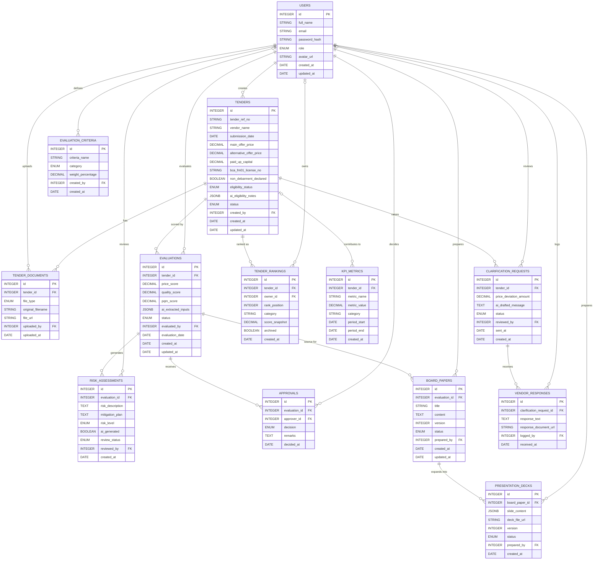

```mermaid
erDiagram
    USERS ||--o{ TENDERS : "creates"
    USERS ||--o{ TENDER_DOCUMENTS : "uploads"
    TENDERS ||--o{ TENDER_DOCUMENTS : "has"
    USERS ||--o{ EVALUATION_CRITERIA : "defines"
    TENDERS ||--o{ EVALUATIONS : "scored by"
    USERS ||--o{ EVALUATIONS : "evaluates"
    EVALUATIONS ||--o{ RISK_ASSESSMENTS : "generates"
    USERS |o--o{ RISK_ASSESSMENTS : "reviews"
    EVALUATIONS ||--o{ APPROVALS : "receives"
    USERS ||--o{ APPROVALS : "decides"
    EVALUATIONS ||--o{ BOARD_PAPERS : "source for"
    USERS ||--o{ BOARD_PAPERS : "prepares"
    BOARD_PAPERS ||--o{ PRESENTATION_DECKS : "expands into"
    USERS ||--o{ PRESENTATION_DECKS : "prepares"
    TENDERS ||--o{ CLARIFICATION_REQUESTS : "raises"
    USERS |o--o{ CLARIFICATION_REQUESTS : "reviews"
    CLARIFICATION_REQUESTS ||--o{ VENDOR_RESPONSES : "receives"
    USERS ||--o{ VENDOR_RESPONSES : "logs"
    TENDERS ||--o{ TENDER_RANKINGS : "ranked as"
    USERS |o--o{ TENDER_RANKINGS : "owns"
    TENDERS |o--o{ KPI_METRICS : "contributes to"

    USERS {
        INTEGER id PK
        STRING full_name
        STRING email
        STRING password_hash
        ENUM role
        STRING avatar_url
        DATE created_at
        DATE updated_at
    }

    TENDERS {
        INTEGER id PK
        STRING tender_ref_no
        STRING vendor_name
        DATE submission_date
        DECIMAL main_offer_price
        DECIMAL alternative_offer_price
        DECIMAL paid_up_capital
        STRING bca_fm01_license_no
        BOOLEAN non_debarment_declared
        ENUM eligibility_status
        JSONB ai_eligibility_notes
        ENUM status
        INTEGER created_by FK
        DATE created_at
        DATE updated_at
    }

    TENDER_DOCUMENTS {
        INTEGER id PK
        INTEGER tender_id FK
        ENUM file_type
        STRING original_filename
        STRING file_url
        INTEGER uploaded_by FK
        DATE uploaded_at
    }

    EVALUATION_CRITERIA {
        INTEGER id PK
        STRING criteria_name
        ENUM category
        DECIMAL weight_percentage
        INTEGER created_by FK
        DATE created_at
    }

    EVALUATIONS {
        INTEGER id PK
        INTEGER tender_id FK
        DECIMAL price_score
        DECIMAL quality_score
        DECIMAL pqm_score
        JSONB ai_extracted_inputs
        ENUM status
        INTEGER evaluated_by FK
        DATE evaluation_date
        DATE created_at
        DATE updated_at
    }

    RISK_ASSESSMENTS {
        INTEGER id PK
        INTEGER evaluation_id FK
        TEXT risk_description
        TEXT mitigation_plan
        ENUM risk_level
        BOOLEAN ai_generated
        ENUM review_status
        INTEGER reviewed_by FK
        DATE created_at
    }

    APPROVALS {
        INTEGER id PK
        INTEGER evaluation_id FK
        INTEGER approver_id FK
        ENUM decision
        TEXT remarks
        DATE decided_at
    }

    BOARD_PAPERS {
        INTEGER id PK
        INTEGER evaluation_id FK
        STRING title
        TEXT content
        INTEGER version
        ENUM status
        INTEGER prepared_by FK
        DATE created_at
        DATE updated_at
    }

    PRESENTATION_DECKS {
        INTEGER id PK
        INTEGER board_paper_id FK
        JSONB slide_content
        STRING deck_file_url
        INTEGER version
        ENUM status
        INTEGER prepared_by FK
        DATE created_at
    }

    CLARIFICATION_REQUESTS {
        INTEGER id PK
        INTEGER tender_id FK
        DECIMAL price_deviation_amount
        TEXT ai_drafted_message
        ENUM status
        INTEGER reviewed_by FK
        DATE sent_at
        DATE created_at
    }

    VENDOR_RESPONSES {
        INTEGER id PK
        INTEGER clarification_request_id FK
        TEXT response_text
        STRING response_document_url
        INTEGER logged_by FK
        DATE received_at
    }

    TENDER_RANKINGS {
        INTEGER id PK
        INTEGER tender_id FK
        INTEGER owner_id FK
        INTEGER rank_position
        STRING category
        DECIMAL score_snapshot
        BOOLEAN archived
        DATE created_at
    }

    KPI_METRICS {
        INTEGER id PK
        INTEGER tender_id FK
        STRING metric_name
        DECIMAL metric_value
        STRING category
        DATE period_start
        DATE period_end
        DATE created_at
    }
```
